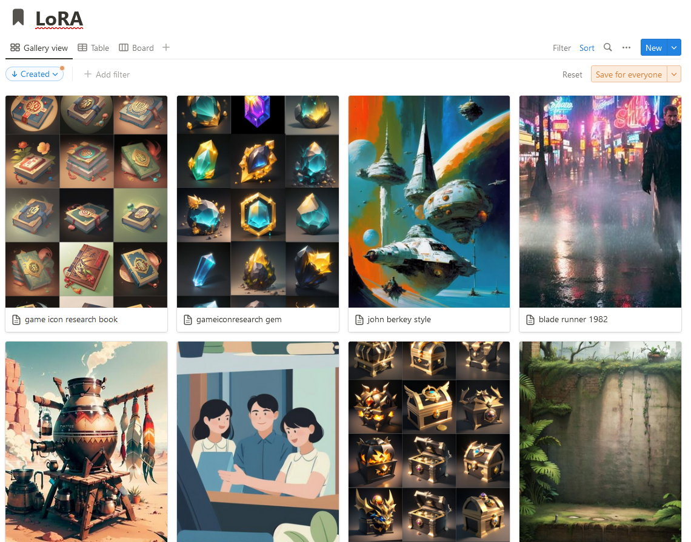
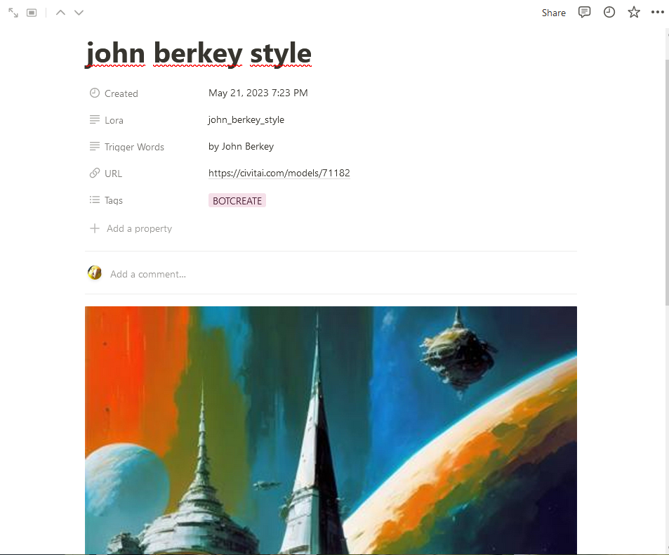
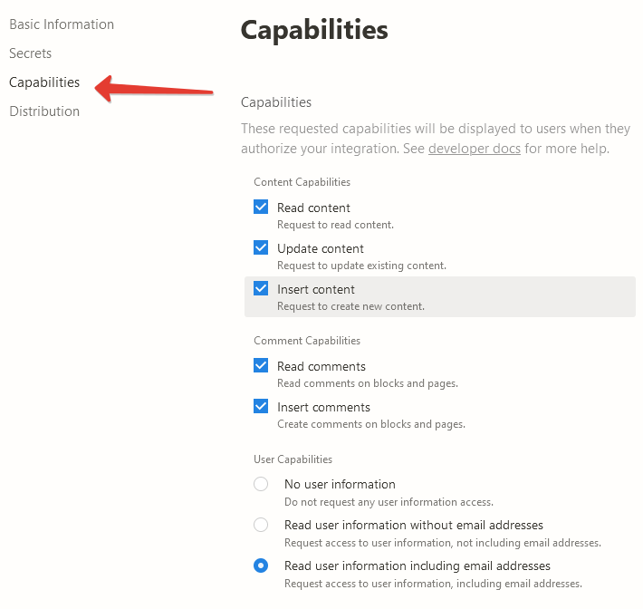
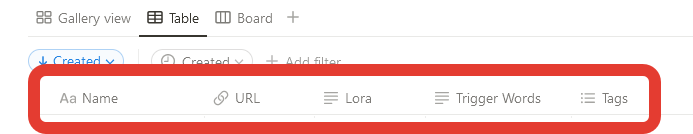
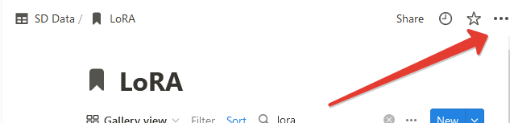
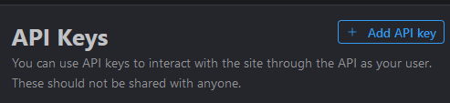
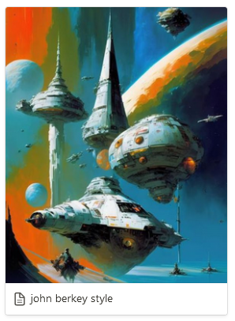

# Info



This repository is designed to synchronize your LoRA bookmarks on the Civitas website and your Notion, as well as to download them automatically


The script writes the names of your LoRA files to your notion database and automatically downloads them, which means that you can use the convenient search for your notion, write notes, and then open the page and simply copy the name of the LoRA file to your prompt

The script also automatically records trigger words and adds an image!



# Notion

#### API Key

1) Go to the [integrations](https://www.notion.so/my-integrations) and create a new integration

2) In the `Capabilities` menu set all permissions

   

3) Copy the API key and write it to `config.json` `notion` - `token`

#### Database

1) Create a new notion database and name it whatever you want. Use the following properties:

   `Lora` - ` Type Text` 
   ` Trigger Words`  - ` Type Text` 
   ` URL`  - ` Type URL` 
   ` Tags`  - ` Type Multi-select` 

   For `Tags`, create the `BOTCREATE` tag, so you will understand which of the entries were added automatically, the rest of the tags can be created at your discretion

   

2) Create a connection for your database so that the script can create records, to do this, select `...` from the top right and click `Add connections`, select your integration

  

3) Copy the `Database ID` while you are on the database page and write it to `config.json` `notion` - `lora_database`
    `Database ID` can be found in the browser line

  ```
  https://www.notion.so/myworkspace/a8aec43384f447ed84390e8e42c2e089?v=...
                                    |--------- Database ID --------|
  ```

# Civitai

#### API Key

1) Go to the [Account Settings](https://civitai.com/user/account)  and create a new  `API Key`
    

2) Copy the API key and write it to `config.json` `civitai` - `token`


# Config 

Write down the path to the directory where you store LoRA `config.json` `save` - `lora_dir`

For example:
```json
...
	"save": {
        "lora_dir": "C:\\Users\\VeyDlin\\Desktop\\lora",
        ...
    }
...
```
Note that for Windows, you need to use a double `\\` in the path


# Additionally 

You can also use large image previews for LoRA cards in notion, for this you can use the `stylish` extension for your browser, add the following styles for the domain `notion.so `



```css
.notion-selectable.notion-page-block.notion-collection-item a > div:first-child > div:first-child > div:first-child {
  height: 350px !important;
}

.notion-selectable.notion-page-block.notion-collection-item a > div:first-child > div:first-child > div:first-child img {
  height: 350px !important;
}
```

# Using

You need Python 3 version

Just run `start.bat` if you are using Windows or `start.sh ` for Linux, the first installation may take some time

Then select one of the options:

1) `Add LoRA from favorites` - Adds all your bookmarks to your notion database, this script uses the URL property in your database to not add what has already been added. In this way, only new LoRA in bookmarks will be imported

   At this stage, your LoRA has not been downloaded yet, go to your database and edit your entries as desired, for example, sometimes you can add another name/title or change the image, as well as remove duplicates (see point 2)

2) `Check LoRA database` - Checks the notion database for duplicates, the check takes place by the `Lora` property, since it will then be used for the names of the files that you download, if duplicates were found, then edit the entries in your notion database, for this you can use the built-in notion search bar to quickly find duplicates by name

3) `Download LoRA from database` - Uses entries in the notion database to upload all new LoRA to your folder. This script compares the names of the `Lora` property with the names from the list of files in your directory and if there is no such, then loads it using the `URL` property

The usage scenario is usually like this:

1) Update your notion database with `Add LoRA from favorites`
2) Edit new entries in your notion database to your liking
3) Run `Download LoRA from database` so that the script downloads all new LoRA
4) Just copy the `Lora` property to your prompt, because the downloaded file is named exactly the same. Use automatically imported trigger words, as well as your personal notes and comments!